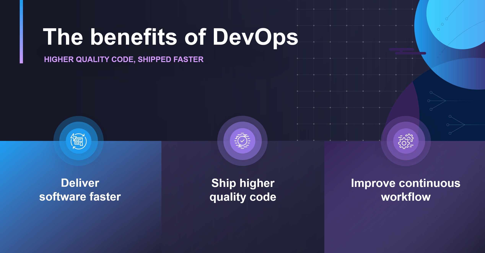
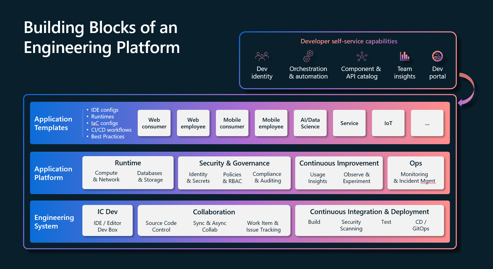
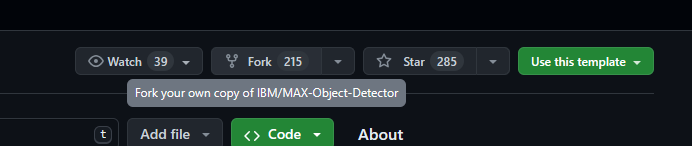
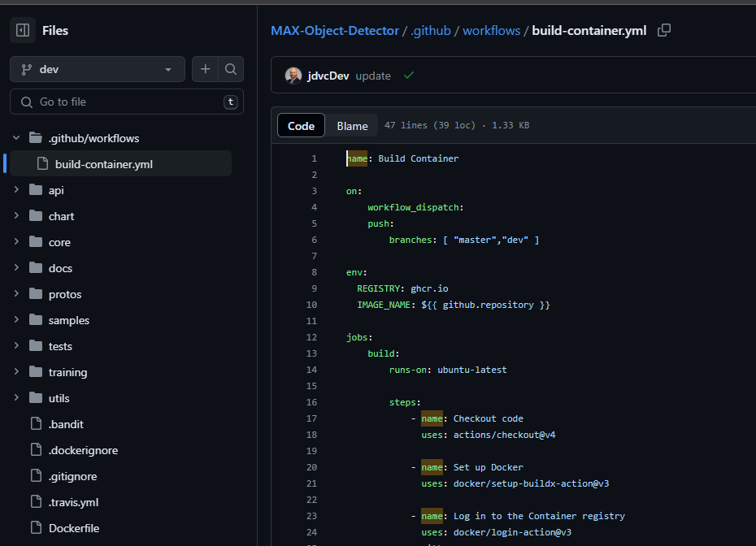
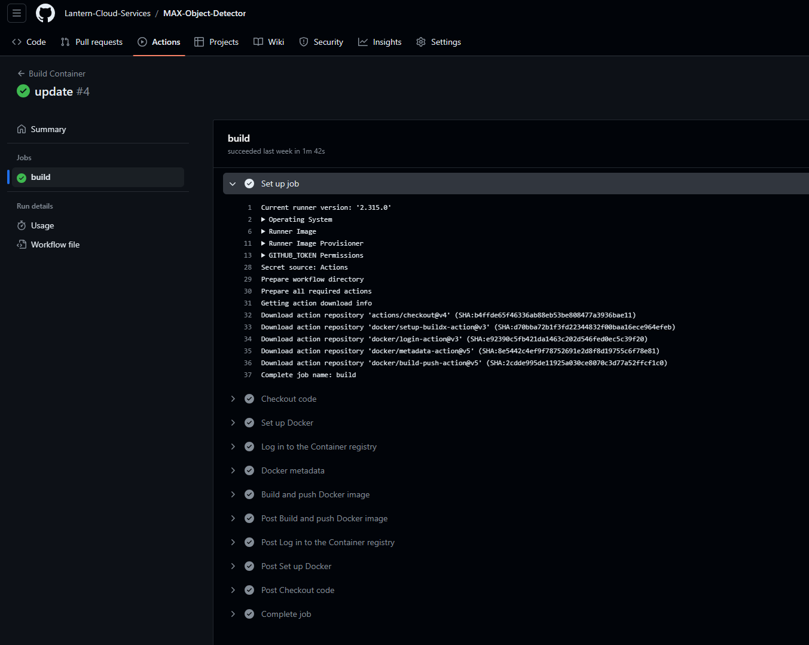
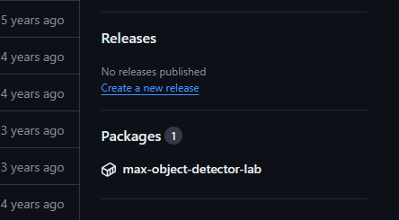

# MLOps101 - DevOps

[**Jason Cook ~ LinkedIn**](https://www.linkedin.com/in/jason-cook-4486b61/) - Developer Experience & Platform Engineering - Azure Global Black Belt Team, Microsoft


## My Journey

- B.S. Mathematics
- Software Eningeering - Enterprise Java
- R&D - Cloud Native Architecture / Prototyping 
- Leadership / Consulting - Cloud Native Architecture and Processes
  -  Developer tools / Platform Engineering

## DevOps What is it and Why Do We Need it?


1. Cross functional teams
   - Shared responsibility model - Less organizational silos
   - Fewer handoffs - Less work in queues
2. Agile SDLC processes
   - Systems thinking - How does what I do effect the larger system?
   - Shorter feedback cycles - Learn and fail faster
   - Culture of experimentation - Innovate
3. Automated everything
   - Continuous Integration / Continuous Deployment - CI/CD
   - Infrastructure as Code - Everything is immutable (once deployed) and idempotent including infrastructure and deplyment processes (**not just applications**)
   - Reduce toil - Make processes reproducable with a history of revision

---




## Platform Engineering - The Evolution of DevOps



## Lab - DevOps in practice

Building from [Lab2](https://github.com/iportilla/deployments/blob/main/lab2/README.md) where you previously built a Docker image, we'll now automate the process of building (**Continous Integration**) the Docker image and the deployment (**Continuous Deplyment**) of the image to an image repository using a GithHub Actions Workflow.

  ***Protip: Do this from a GitHub Codespace***
  
  ### 1. Fork the [Max-Object-Detector Repo](https://github.com/IBM/MAX-Object-Detector.git) (can clone but more work to commit changes)



or clone

```bash
git clone https://github.com/IBM/MAX-Object-Detector.git
```


  ### 2. Create a workflow directory

  Change directory into the repository base folder:

```bash
cd MAX-Object-Detector
```

  Create new workflow directory:

```bash
mkdir .github
cd .github
mkdir workflows
```

  ### 3. Create an actions file

  Copy the contents from [build-container.yml](./resource/build-container.yml) into a new file with the same name in the new workflow directory:

  **If working from linux command line:**
```bash
cd workflows
vi build-container.yml
```

  **From codespace / IDE:**

  

  ### 4. Commit changes to project repo

  Push this new actions file to your repo on GitHub, if the changes are pushed to the `master` or `dev` branch, the workflow will be triggered.



  Once the action completes, you can fine the docker image deployed to the GitHub container registry:



### Anatomy of the workflow:

1. Trigger - Conditions when the workflow executes.  In this case manually `workflow_dispatch` or when a change is committed to the branches `[ "master", "dev"]`
```yaml
on:
    workflow_dispatch:
    push:
        branches: [ "master","dev" ]
```

2. Environmental Parameters

```yaml
env:
  REGISTRY: ghcr.io
  IMAGE_NAME: ${{ github.repository }}
```

3. Jobs/Steps - The work to be done and the host it runs on.  In this case we'll run a job called `build` on `ubuntu-latest` which builds our Docker image then deploys it to the GitHub Container Registry `- name: Build and push Docker image`

```yaml
jobs:
    build:
        runs-on: ubuntu-latest

        steps:
            - name: Checkout code
              uses: actions/checkout@v4

            - name: Set up Docker
              uses: docker/setup-buildx-action@v3
...              
```

  ### 5. Action Complete  
  We've effectively created a CI/CD process at this point where our pipeline executes and creates a new Docker image anytime a change is committed (CI) to our repo.  That change is then deployed (CD) to an image repository.

  - In a real world production environment we would configure our containerization platform (Docker, Kubernetes, etc) to pull the new image from the repository anytime a new version is available.

## Questions / Challenges

* How do ensure our changes to the environment or image dont clobber other people changes?
* What kind of controlls might we put in place to keep defects from being propagated to a production environment?
* How do we ensure that the image tested is the same that gets deployed?  Hint: Do we propagate the code or the created image through our environments?
